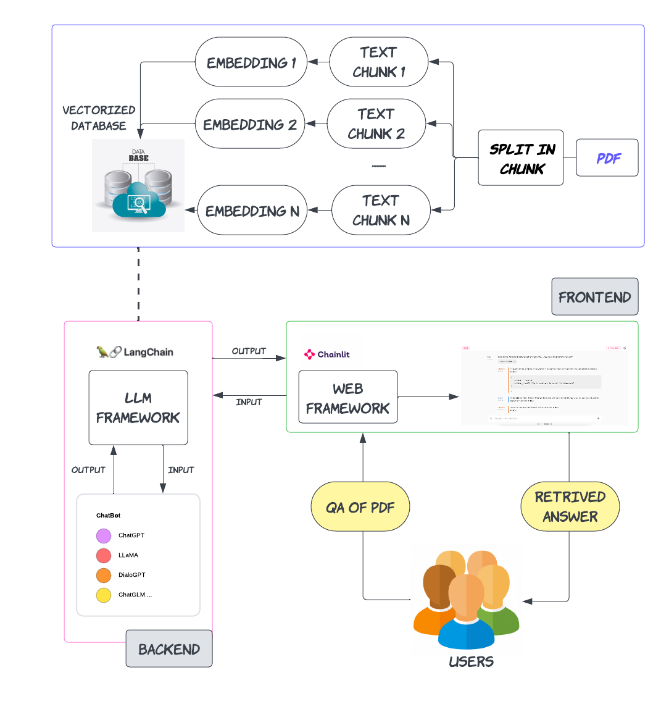

### Ver1 
- [ ] Chat
- [ ] Dialogpt
- [ ] Llama
- [ ] Support PDF

### How to run GambitBot?

Chainlit provides the functionality and Langchain implements the current version of GSBot using Llama-2-7B-Chat-GGML.
To execute the project, merely execute the commands below:
1. Install each dependency that is necessary:
```
pip install -r requirements.txt
```
2. Create the vectorized database
```
python run_vdb.py
```
3. Run GambitBot using the Chainlit
```
chainlit run run_bot.py -w
```
Await the bot's welcome message before proceeding: "Hi, Welcome to PDF Bot. What is your query?", and then ask the question.

### Workflow

Below is a diagram that describes how GambitBot works:


